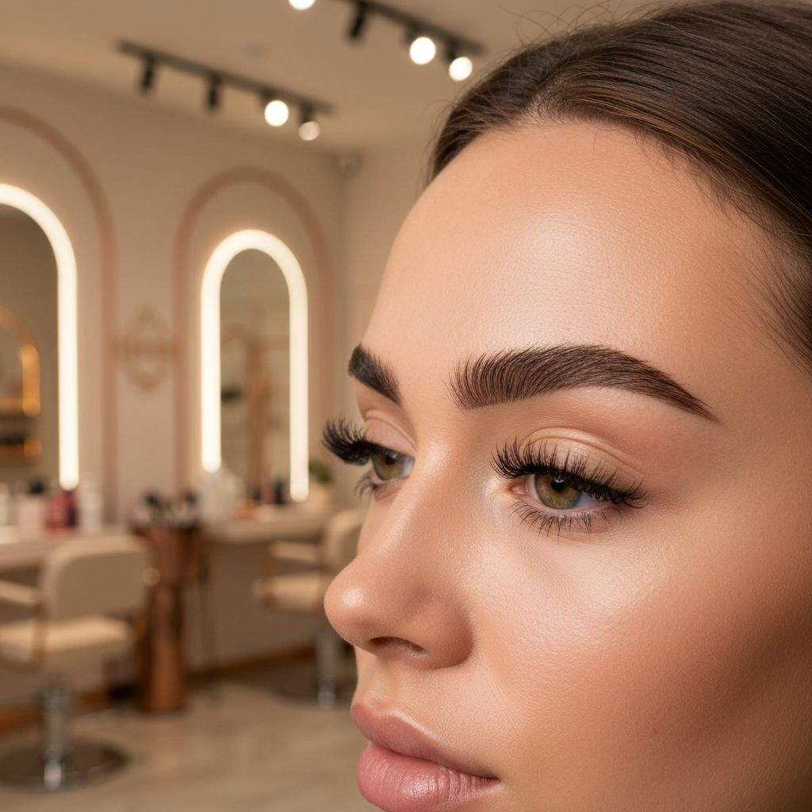
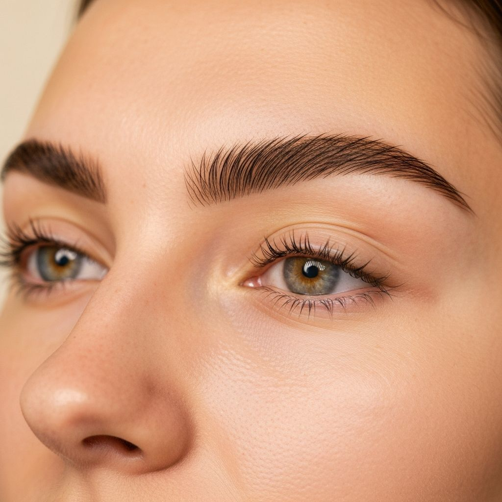
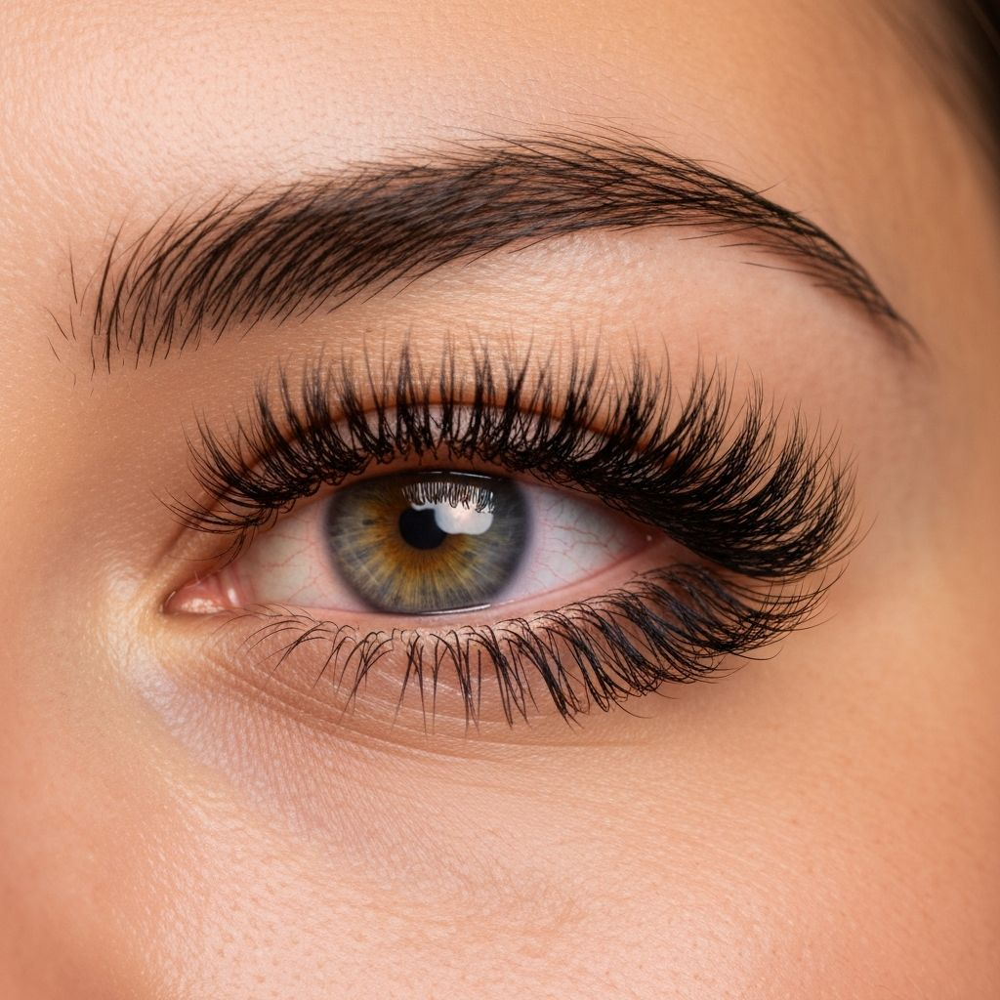
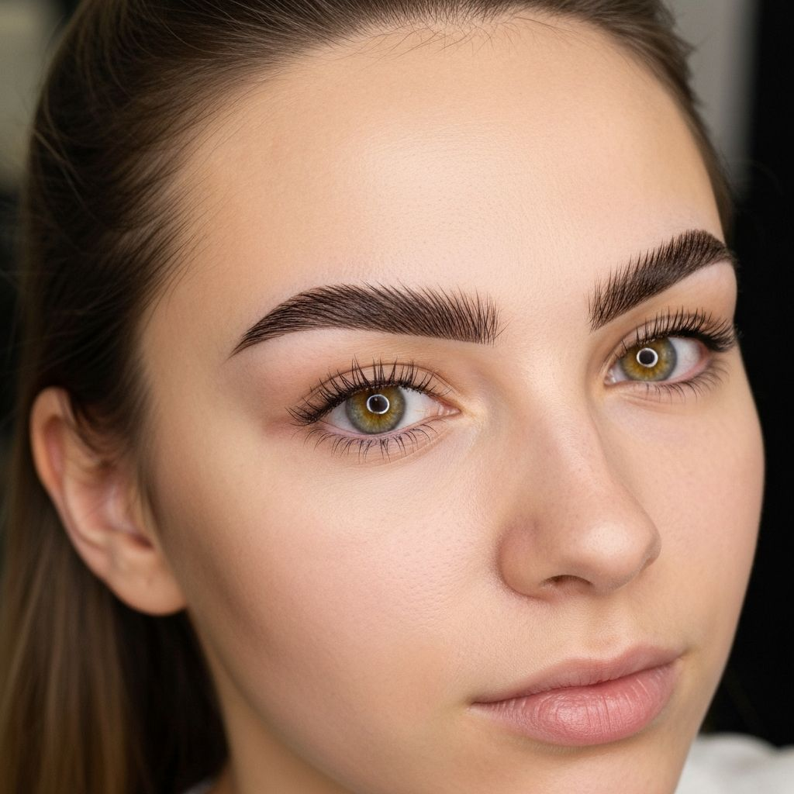
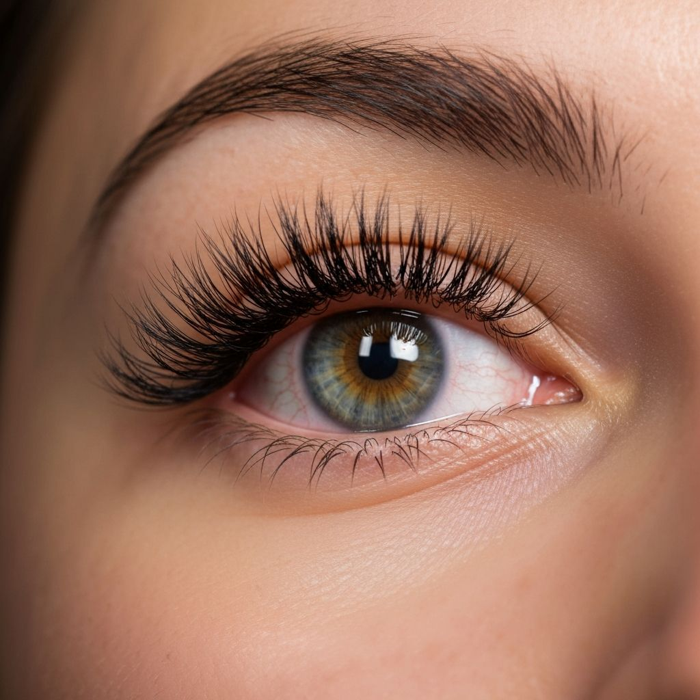
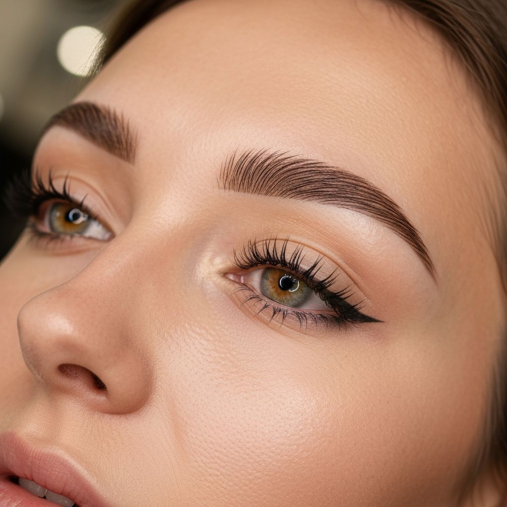
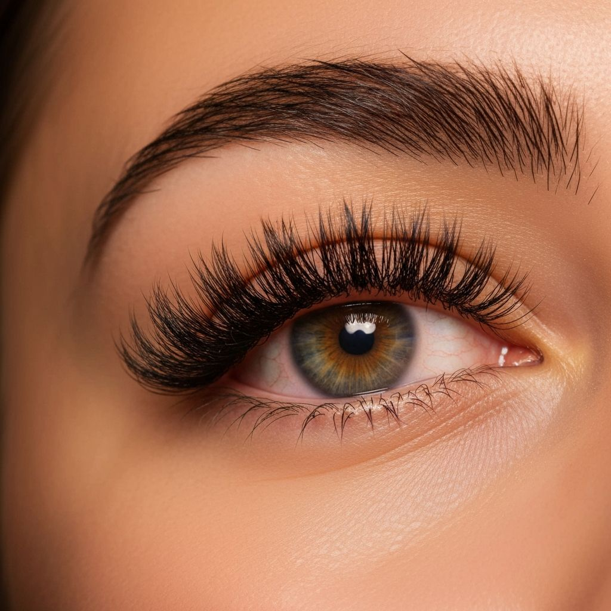
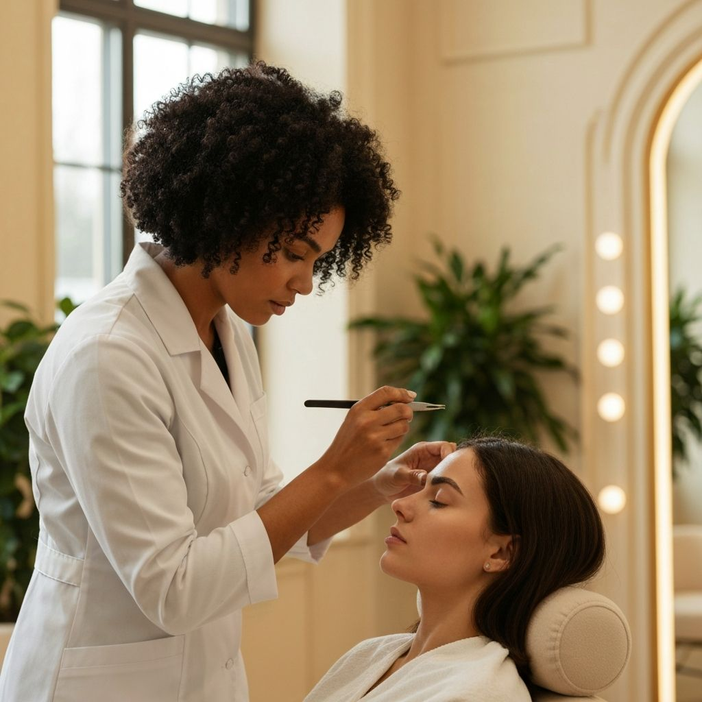

# Brows and Lashes by UniqSwek

A modern, elegant website for **Brows and Lashes by UniqSwek** — a premier beauty salon located in the Upper East Side of New York City, specializing in threading, waxing, facials, and eyelash extensions.



---

## About the Business

**Brows and Lashes by UniqSwek** is your go-to destination for beauty and self-care on the Upper East Side! The salon is committed to enhancing natural beauty with expert care and precision. Founded by Swekchha Luitel, the team of highly trained specialists is passionate about delivering personalized, high-quality services tailored to each client's unique preferences.

### Location & Contact

| | |
|---|---|
| **Address** | 1240 Lexington Avenue, New York, NY 10028 |
| **Phone** | +1 (917) 388-2434 |
| **Website** | [yoursimplebrows.com](https://yoursimplebrows.com) |
| **Booking** | [simplebrows.trafft.com](https://simplebrows.trafft.com) |

---

## Services Offered

### Threading & Brows
- Eyebrow Threading
- Eyebrow Waxing
- Eyebrow Tinting
- Male Eyebrow Threading
- Full Face Threading

### Lash Services
- Classic Lash Extensions
- Volume Lash Extensions
- Hybrid Lash Extensions
- Lash Lift & Tint
- Eyelash Tinting

### Waxing
- Full Body Waxing
- Brazilian Wax
- Leg Waxing
- Arm Waxing
- Underarm Waxing

### Facials & More
- Classic Facial
- Deep Cleanse Facial
- Hydrating Facial
- Henna Tattoos
- Anti-Aging Treatment

---

## Website Features

This website includes the following sections:

| Section | Description |
|---------|-------------|
| **Hero** | Full-screen hero with tagline "Beauty with the Thread" and booking CTA |
| **About** | Company story, mission, and key statistics |
| **Services** | Interactive tabbed menu with all services and pricing |
| **Gallery** | Lightbox gallery showcasing work (brows, lashes, treatments) |
| **Testimonials** | Real 5-star client reviews with carousel navigation |
| **Booking** | Quick booking section linking to Trafft booking system |
| **Contact** | Location map, phone, hours, and social links |
| **Footer** | Quick links, services, and social media |

---

## Screenshots

### Gallery Showcase

| | | |
|:---:|:---:|:---:|
|  |  |  |
| Microbladed Brows | Volume Lashes | Brow Lamination |

| | | |
|:---:|:---:|:---:|
|  |  |  |
| Classic Lashes | Ombre Powder Brows | Hybrid Lashes |

### About the Artist



---

## Tech Stack

| Technology | Purpose |
|------------|---------|
| **Next.js 16** | React framework with App Router |
| **React 19** | UI library |
| **TypeScript** | Type safety |
| **Tailwind CSS 4** | Utility-first styling |
| **shadcn/ui** | Component library |
| **Lucide React** | Icon system |
| **Embla Carousel** | Testimonials carousel |
| **Vercel** | Deployment & hosting |

---

## Design System

### Color Palette

| Token | Color | Usage |
|-------|-------|-------|
| `--background` | Warm Cream | Page background |
| `--foreground` | Deep Brown | Primary text |
| `--primary` | Rose/Mauve | CTAs, accents |
| `--secondary` | Soft Beige | Secondary elements |
| `--accent` | Dusty Rose | Highlights |
| `--muted` | Light Cream | Subtle backgrounds |

### Typography

- **Headings**: Cormorant Garamond (elegant serif)
- **Body**: Montserrat (clean sans-serif)

---

## Getting Started

### Prerequisites

- Node.js 18+ 
- pnpm (recommended) or npm

### Installation

```bash
# Clone the repository
git clone https://github.com/Uniq1st/brows-and-lashes-website.git

# Navigate to project directory
cd brows-and-lashes-website

# Install dependencies
pnpm install

# Start development server
pnpm dev
```

Open [http://localhost:3000](http://localhost:3000) to view the website.

### Build for Production

```bash
pnpm build
pnpm start
```

---

## Project Structure

```
brows-and-lashes-website/
├── app/
│   ├── globals.css      # Global styles & design tokens
│   ├── layout.tsx       # Root layout with fonts
│   └── page.tsx         # Main page composition
├── components/
│   ├── navigation.tsx   # Header & mobile menu
│   ├── hero-section.tsx # Hero banner
│   ├── about-section.tsx
│   ├── services-section.tsx
│   ├── gallery-section.tsx
│   ├── testimonials-section.tsx
│   ├── booking-section.tsx
│   ├── contact-section.tsx
│   ├── footer.tsx
│   └── ui/              # shadcn/ui components
├── public/
│   └── images/          # Hero, gallery, about images
└── package.json
```

---

## Deployment

This project is deployed on **Vercel**. Any push to the `main` branch triggers an automatic deployment.

[](https://vercel.com/new/clone?repository-url=https://github.com/Uniq1st/brows-and-lashes-website)

---

## License

This project is proprietary and owned by **Brows and Lashes by UniqSwek Inc.**

---

<p align="center">
  <strong>Brows and Lashes by UniqSwek</strong><br>
  <em>Beauty with the Thread</em><br><br>
  1240 Lexington Avenue, New York, NY 10028<br>
  <a href="tel:+19173882434">+1 (917) 388-2434</a> · 
  <a href="https://yoursimplebrows.com">yoursimplebrows.com</a>
</p>
